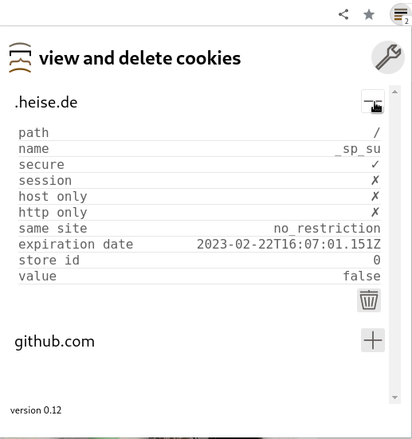
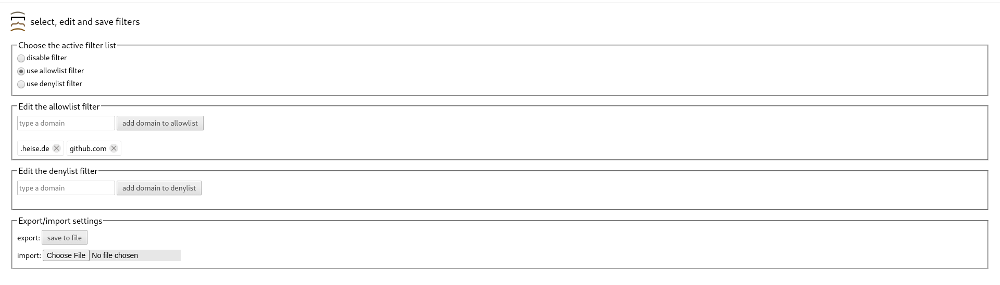

# Cookie Stack

firefox and chromium extension for managing cookies. Includes automatic deletion of cookies by domain.

**NOTE**: cookies may contain sensitive information

# How to enable the extension:

## Firefox
* point the browser to `about:debugging#/runtime/this-firefox`
* tap the `Load Temporary Add-On` button
* select `manifest.json` file from `cookie-stack`'s root directory

* if firefox is in private mode, go to `about:addons`, and allow `Cookie Stack` to run in private windows

## Chromium
* point the browser to `chrome://extensions/`
* tap the `Load Unpacked` button
* select `cookie-stack`'s root directory

* if chromium is in Incognito Mode, go to the extensions settings, and switch on `allow in incognito`

# How to use the extension:

The extension has three main funtionalities:

## 1. View and delete cookies

Access it by clicking the icon at the toolbar of your browser, displaying the number of cookies currently set.



* click the toolbar icon to get an overview of domains they belong to
* expand or contract those domains by clicking the plus or minus symbol next to it to view specific cookies
* delete a cookie by clicking the trash icon at the bottom of its details

## 2. Automatically filter incoming cookies by domain

* go to the extension's preferences (firefox), options (chromium)



* **allowlist**: allow every cookie on the list, remove the rest
* **denylist**: deny every cookie specified, allow the rest

To add a domain to a specific list, write the domain name into the textfield next to specific list and hit the `add` button.

Remove a domain from a list, click the *x* on the displayed domain name. 

**NOTE**: The filter doesn't prevent cookies from getting initially stored. *Cookies get filtered afterwards*. Some websites continuosly try to store cookies on your machine, even after the first pageload. This might cause the filter also to continuosly remove said cookies.

## 3. Export and import the extension's settings

The export- and importable settings are the ones shown at the bottom of the preferences (firefox), options (chromium) page, for now this is a value for the currently active list (disabled, allowlist, denylist) and their contents.

* go to the preferences (firefox), options (chromium)

Export the current settings by clicking the `save to file` button, which will open a file dialog, where the destination folder and file can be choosen.

Import settings by clicking the `Browse files` (firefox) or `Choose File` (chromium) button. This will present a file dialog where the file, from which the settings are read, can be selected. This process will override the currently existing settings.

The settings file is in JSON format, requires the following key-value pairs:

* **ss**: the name of the selected filter, possible values: disabled, allowlist, denylist
* **fa**: the allowlist - an array of strings, where the strings are domain-names
* **fd**: the denylist - also an array of domain-names

Here is an exemplary settings file:

```
{
    "ss": "allowlist",
    "fa": ["github.com", "heise.de"],
    "fd": []
}
```

Enjoy!