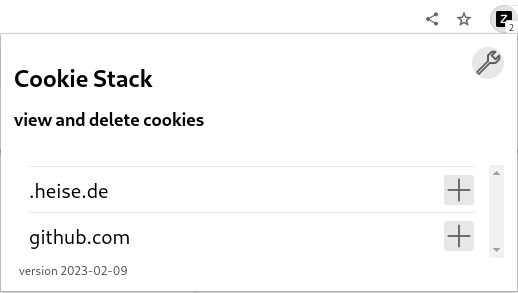
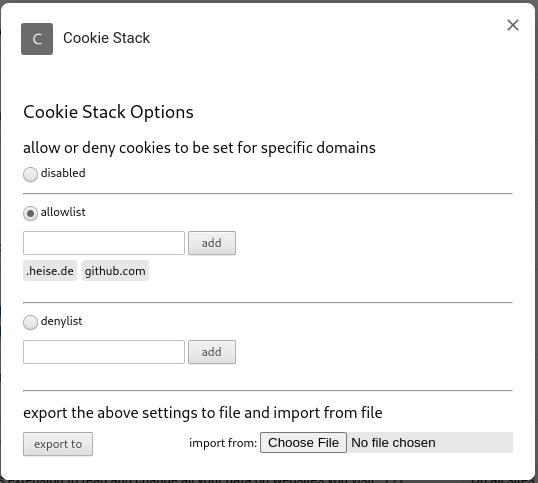

# Cookie Stack

A Firefox/Chromium extension for viewing and deleting cookies.

**NOTE**: cookies may contain sensitive information

# How to enable the extension:

## Firefox
* point the browser to `about:debugging#/runtime/this-firefox`
* tap the `Load Temporary Add-On` button
* select `manifest.json` file from `cookie-stack`'s root directory

* if firefox is in private mode, go to `about:addons`, and allow `Cookie Stack` to run in private windows

## Chromium
* point the browser to `chrome://extensions/`
* tap the `Load Unpacked` button
* select `cookie-stack`'s root directory

* if chromium is in Incognito Mode, go to the extensions settings, and switch on `allow in incognito`

# How to use the extension:

The extension has three main funtionalities:

## 1. View and remove cookies

Access it by clicking the icon at the toolbar of your browser, displaying the number of cookies currently set.

* click the toolbar icon to get an overview of domains they belong to
* expand or contract those domains by clicking the plus or minus symbol next to it to view specific cookies
* delete a cookie by clicking the trash icon at the bottom of it's details

## 2. Automatically filter incoming cookies by domain

* go to the preferences (firefox), options (chromium)

* *disabled*: no filter gets applied
* *allowlist*: allow every cookie on the list, remove the rest
* *denylist*: deny every cookie specified, allow the rest

To add a domain to a specific list, write the domain name into the textfield next to specific list and hit the *add* button.

Remove a domain from a list, click on the displayed domain below the specific list. 

**NOTE**: The filter doesn't prevent cookies from getting initially stored. Cookies get filtered *afterwards*. Some websites continuosly try to store cookies on your machine, even after the first pageload. This might cause the filter also to continuosly remove said cookies.

## 3. Export and import the extension's settings

The export- and importable settings are the ones shown at the bottom of the preferences (firefox), options (chromium) page, for now this is the active list (disabled, allowlist, denylist) and their contents.

* go to the preferences (firefox), options (chromium)

Export the current settings by clicking the *export to* button, which will open a file dialog, where the destination folder and file can be choosen.

Import settings by clicking the *Browse files* (firefox) or *Choose File* button. This will present a file dialog where the file from which the settings will be read can be selected. This process will override the currently existing setting.
