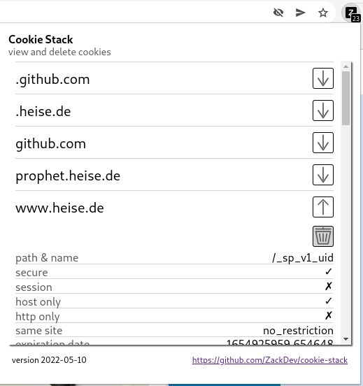

# Cookie Stack

A Firefox/Chromium extension for viewing and deleting cookies.

**NOTE**: cookies may contain sensitive information

# How to enable the extension:

## Firefox
* point the browser to `about:debugging#/runtime/this-firefox`
* tap the `Load Temporary Add-On` button
* select `manifest.json` file from `cookie-stack`'s root directory

* if firefox is in private mode, go to `about:addons`, and allow `Cookie Stack` to run in private windows

## Chromium
* point the browser to `chrome://extensions/`
* tap the `Load Unpacked` button
* select `cookie-stack`'s root directory

* if chromium is in Incognito Mode, go to the extensions settings, and switch on `allow in incognito`

# How to use the extension:

The add-on adds an icon to the toolbar of your browser, displaying the number of cookies currently set.

* Click the toolbar icon to get an overview of domains they belong to
* Expand or contract those domains by clicking the down or up facing arrow to view specific cookies
* Delete a cookie by clicking the trash icon

# Issues:

**firefox**:
* Cookies, whose url (domain + path) isn't fully recontructible by the cookies returned by `browser.coolies.getAll({})` API call, can't be removed by this extension.