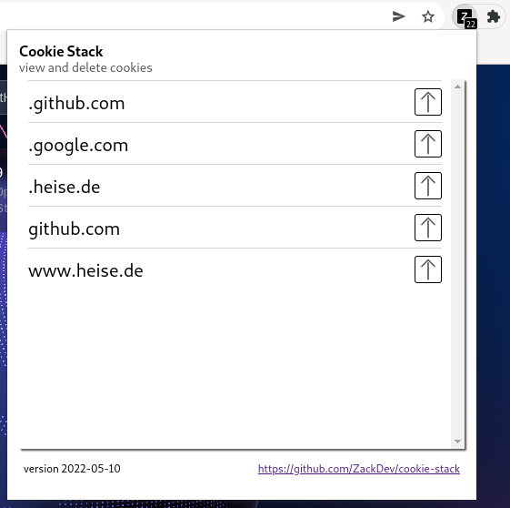

# Cookie Stack

A Firefox browser extension for viewing and deleting cookies.

The add-on adds an icon to the toolbar of your browser, displaying the number of cookies currently set.

# How to enable the extension:

* point the browser to `about:debugging#/runtime/this-firefox`
* click `Load Temporary Add-On`
* select `manifest.json` file from `cookie-stack`'s root directory

* if your browser is in private mode, go to `about:addons`, and allow `Cookie Stack` to run in private windows

# How to use the extension:

* Click the toolbar icon to get an overview of domains they belong to
* Expand or contract those domains by clicking the down or up facing arrow to view specific cookies
* Delete a cookie by clicking the trash icon
